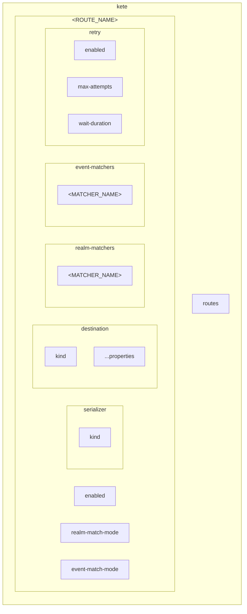
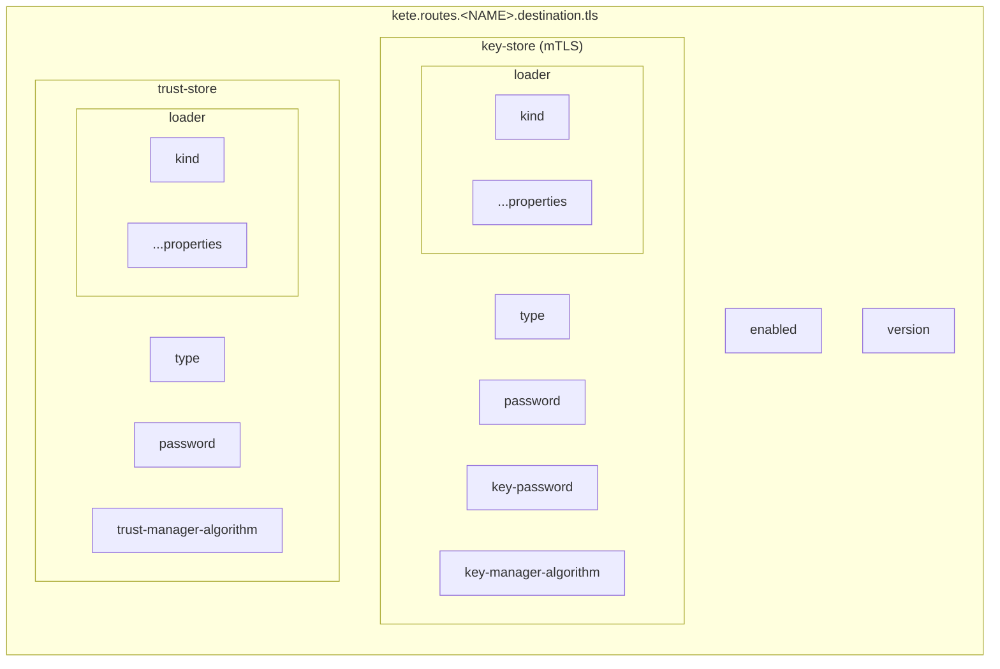

# Configuration Reference

## Table of Contents

- [Overview](#overview)
- [Configuration Sources](#configuration-sources)
- [Route Configuration](#route-configuration)
- [Match Modes](#match-modes)
- [Retry Configuration](#retry-configuration)
- [TLS/SSL Configuration](#tlsssl-configuration)
- [Template Variables](#template-variables)
- [Environment Variable Examples](#environment-variable-examples)


## Overview

The extension is configured through **environment variables** and/or **Keycloak SPI configuration**. This makes it container-friendly and easy to manage across different environments.

### Configuration Hierarchy



**Property Path Example:** `kete.routes.my-route.destination.kind=kafka`


## Configuration Sources

KETE reads configuration from **two sources**, merged in this order:

1. **Keycloak SPI Configuration** (XML/properties) - Base configuration
2. **Environment Variables** - Override/extend base configuration

Environment variables take precedence over SPI configuration, allowing you to define defaults in XML and override specific values via environment.

### Keycloak SPI Configuration (Bare Metal / Standalone)

For traditional Keycloak deployments, configure KETE via the Keycloak SPI mechanism.

#### Quarkus-based Keycloak (v17+)

Add to `conf/keycloak.conf` or `conf/quarkus.properties`:

```properties
# Enable the event listener
spi-events-listener-kete-enabled=true

# KETE configuration
spi-events-listener-kete-routes-kafka-example-destination-kind=kafka
spi-events-listener-kete-routes-kafka-example-destination-bootstrap-servers=kafka:9092
spi-events-listener-kete-routes-kafka-example-destination-topic=keycloak-events
```

Or pass as CLI arguments:

```bash
bin/kc.sh start \
  --spi-events-listener-kete-routes-kafka-example-destination-kind=kafka \
  --spi-events-listener-kete-routes-kafka-example-destination-bootstrap-servers=kafka:9092 \
  --spi-events-listener-kete-routes-kafka-example-destination-topic=keycloak-events
```

#### Legacy Keycloak (WildFly-based, pre-v17)

Add to `standalone.xml` under `<subsystem xmlns="urn:jboss:domain:keycloak-server:1.1">`:

```xml
<spi name="eventsListener">
    <provider name="kete" enabled="true">
        <properties>
            <property name="routes.kafka-example.destination.kind" value="kafka"/>
            <property name="routes.kafka-example.destination.bootstrap.servers" value="kafka:9092"/>
            <property name="routes.kafka-example.destination.topic" value="keycloak-events"/>
            <property name="routes.kafka-example.realm-matchers.realm" value="list:master"/>
        </properties>
    </provider>
</spi>
```

### Environment Variables

All configuration is read from environment variables with the prefix: `kete.`

### Docker Example

```bash
docker run -e kete.routes.kafka-example.destination.kind=kafka \
  # ... more variables ...
  keycloak:latest
```

### Kubernetes Example

```yaml
apiVersion: v1
kind: ConfigMap
metadata:
  name: keycloak-config
data:
  kete.routes.kafka-example.realm-matchers.realm: "list:master"
  kete.routes.kafka-example.destination.kind: "kafka"
  kete.routes.kafka-example.destination.bootstrap.servers: "kafka:9092"
  kete.routes.kafka-example.destination.topic: "keycloak-events"
  # ...
```

### Docker Compose Example

```yaml
services:
  keycloak:
    environment:
      kete.routes.kafka-example.realm-matchers.realm: "list:master"
      kete.routes.kafka-example.destination.kind: "kafka"
      kete.routes.kafka-example.destination.bootstrap.servers: "kafka:9092"
      kete.routes.kafka-example.destination.topic: "keycloak-events"
      # ...
```

### Standalone Keycloak

For standalone Keycloak, set environment variables before starting:

**Linux/macOS**:
```bash
export kete.routes.kafka-example.realm-matchers.realm=list:master
export kete.routes.kafka-example.destination.kind=kafka
export kete.routes.kafka-example.destination.bootstrap.servers=kafka:9092
export kete.routes.kafka-example.destination.topic=keycloak-events
# ...
$KEYCLOAK_HOME/bin/kc.sh start
```

**Windows (CMD)**:
```cmd
set kete.routes.kafka-example.realm-matchers.realm=list:master
REM ...
%KEYCLOAK_HOME%\bin\kc.bat start
```

**Windows (PowerShell)**:
```powershell
$env:kete.routes.kafka-example.destination.kind="kafka"
# ...
& "$env:KEYCLOAK_HOME\bin\kc.bat" start
```


## Route Configuration

Each route is configured with a unique name under `kete.routes.<NAME>`.

### Route Properties

| Property | Type | Default | Description |
|----------|------|---------|-------------|
| `kete.routes.<NAME>.enabled` | Boolean | `true` | Enable/disable this route |
| `kete.routes.<NAME>.realm-match-mode` | String | `any` | How to evaluate realm matchers: `any` or `all` |
| `kete.routes.<NAME>.event-match-mode` | String | `any` | How to evaluate event matchers: `any` or `all` |

### Global Configuration

| Property | Type | Default | Description |
|----------|------|---------|-------------|
| `kete.enabled` | Boolean | `true` | Master switch; when `false` KETE removes itself from every realm's event listeners |
| `kete.metrics.enabled` | Boolean | `false` | Register Micrometer meters (Keycloak metrics must also be enabled) |
| `kete.support-the-project-message` | Boolean | `true` | Log the support/sponsorship banner at start-up |

### Serializer Configuration

| Property | Type | Default | Description |
|----------|------|---------|-------------|
| `kete.routes.<NAME>.serializer.kind` | String | `json` | Serializer kind: `json`, `xml`, `yaml`, `csv`, `toml`, `smile`, `cbor`, `properties`, `template`, `avro`, `protobuf`, `multipart-form`, `url-encoded-form` |

JSON serialization is used by default if no serializer is specified.

### Destination Configuration

| Property | Type | Default | Description |
|----------|------|---------|-------------|
| `kete.routes.<NAME>.destination.kind` | String | - | Destination kind (required): `kafka`, `amqp-0.9.1`, `amqp-1`, `mqtt-3`, `mqtt-5`, `http`, `websocket`, `nats`, `nats-jetstream`, `redis-pubsub`, `redis-stream`, `pulsar`, `stomp`, `zeromq`, `signalr`, `socketio`, `aws-sns`, `aws-sqs`, `aws-kinesis`, `aws-eventbridge`, `gcp-pubsub`, `gcp-cloud-tasks`, `azure-storage-queue`, `azure-webpubsub`, `azure-eventhubs`, `azure-servicebus`, `azure-eventgrid`, `grpc`, `soap` |
| `kete.routes.<NAME>.destination.authentication-type` | String | - | Authentication method (allowed values are destination-specific) |
| `kete.routes.<NAME>.destination.headers.<header>` | String | - | Custom header/property/attribute; `eventkind`, `eventtype`, `contenttype` are reserved and ignored |
| `kete.routes.<NAME>.destination.content-encoding` | String | - | `gzip` or `deflate` |
| `kete.routes.<NAME>.destination.content-transfer-encoding` | String | - | `base64` |
| `kete.routes.<NAME>.destination.pool.min-idle` | Integer | `1` | Minimum idle pool size. Must be > 0. |
| `kete.routes.<NAME>.destination.pool.max-idle` | Integer | `10` | Maximum idle pool size. |
| `kete.routes.<NAME>.destination.pool.max-total` | Integer | `20` | Maximum total pool size. Must be >= min-idle. |
| `kete.routes.<NAME>.destination.pool.max-wait-seconds` | Integer | `30` | Max wait for an instance when exhausted (`-1` = indefinitely) |
| `kete.routes.<NAME>.destination.pool.block-when-exhausted` | Boolean | `true` | Wait (rather than fail) when the pool is exhausted |
| `kete.routes.<NAME>.destination.pool.lifo` | Boolean | `true` | Last-in-first-out reuse |
| `kete.routes.<NAME>.destination.pool.fairness` | Boolean | `false` | FIFO fairness for waiting borrowers |
| `kete.routes.<NAME>.destination.pool.test-on-create` | Boolean | `true` | Validate on creation |
| `kete.routes.<NAME>.destination.pool.test-on-borrow` | Boolean | `true` | Validate (`isHealthy()`) on borrow |
| `kete.routes.<NAME>.destination.pool.test-on-return` | Boolean | `true` | Validate on return |
| `kete.routes.<NAME>.destination.pool.test-while-idle` | Boolean | `true` | Validate idle instances during eviction runs |
| `kete.routes.<NAME>.destination.pool.num-tests-per-eviction-run` | Integer | `3` | Instances tested per eviction run |
| `kete.routes.<NAME>.destination.pool.time-between-eviction-runs-seconds` | Integer | `60` | Eviction interval |
| `kete.routes.<NAME>.destination.pool.min-evictable-idle-time-seconds` | Integer | `-1` | Hard idle eviction (disabled) |
| `kete.routes.<NAME>.destination.pool.soft-min-evictable-idle-time-seconds` | Integer | `1800` | Soft idle eviction above `min-idle` |
| `kete.routes.<NAME>.destination.*` | Various | - | Destination-specific properties (see destination guides) |

```bash
kete.routes.my-route.realm-matchers.realm=list:master
kete.routes.my-route.destination.kind=kafka
kete.routes.my-route.destination.bootstrap.servers=kafka:9092
kete.routes.my-route.destination.topic=keycloak-events

# Optional: Configure connection pool size
kete.routes.my-route.destination.pool.min-idle=3
kete.routes.my-route.destination.pool.max-total=15
```

### Matcher Configuration

Matchers filter which events a route processes. There are two types:

- **Realm Matchers** (`realm-matchers.<NAME>`) - Filter by Keycloak realm
- **Event Matchers** (`event-matchers.<NAME>`) - Filter by event type

Each matcher value follows the format `kind:pattern` or `kind:not:pattern`.

| Format | Description | Example |
|--------|-------------|---------|
| `kind:pattern` | Match values matching pattern | `glob:LOGIN*` |
| `kind:not:pattern` | Exclude values matching pattern | `glob:not:REFRESH*` |

**Matcher Kinds**:
- `glob` - Unix-style wildcards (`*`, `?`, `[abc]`)
- `regex` - Regular expressions
- `list` - Comma-separated list (case-insensitive)
- `sql` - SQL LIKE patterns (`%`, `_`)

All matchers perform case-insensitive matching.

```bash
# Filter by realm
kete.routes.my-route.realm-matchers.realm=list:master,production

# Accept login events
kete.routes.my-route.event-matchers.login=glob:LOGIN*

# Exclude refresh events
kete.routes.my-route.event-matchers.no-refresh=glob:not:REFRESH*

# Multiple event matchers with ANY mode (default)
kete.routes.my-route.event-match-mode=any
kete.routes.my-route.event-matchers.login=glob:LOGIN*
kete.routes.my-route.event-matchers.logout=glob:LOGOUT*
```

### Retry Configuration

| Property | Type | Default | Description |
|----------|------|---------|-------------|
| `kete.routes.<NAME>.retry.enabled` | Boolean | `true` | Enable retry with Resilience4j |
| `kete.routes.<NAME>.retry.max-attempts` | Integer | `3` | Maximum number of attempts (including initial call) |
| `kete.routes.<NAME>.retry.wait-duration` | Duration | `500ms` | Wait between retries |

```bash
kete.routes.my-route.retry.max-attempts=5
kete.routes.my-route.retry.wait-duration=PT2S
```


## Match Modes

Routes support separate match modes for realm and event matchers:

**Variables**: 
- `kete.routes.<NAME>.realm-match-mode`
- `kete.routes.<NAME>.event-match-mode`

**Type**: String (enum)

**Default**: `any`

**Valid Values**: `any`, `all`

**Description**: Controls how multiple matchers are evaluated for realms and events independently.

### ANY Mode (Default)

Accept an event if **ANY** matcher matches (logical OR):

```bash
kete.routes.alerts.event-match-mode=any
kete.routes.alerts.event-matchers.login=glob:LOGIN*
kete.routes.alerts.event-matchers.logout=glob:LOGOUT*
# Matches: LOGIN, LOGIN_ERROR, LOGOUT, LOGOUT_TIMEOUT
```

### ALL Mode

Accept an event only if **ALL** matchers match (logical AND):

```bash
kete.routes.error-handler.event-match-mode=all
kete.routes.error-handler.event-matchers.has-login=glob:*LOGIN*
kete.routes.error-handler.event-matchers.no-success=glob:not:*SUCCESS*
# Matches: LOGIN_ERROR, LOGIN_FAILED (but NOT: LOGIN_SUCCESS)
```

### Negation with Match Modes

Combine `not:` prefix with match modes for powerful filtering:

```bash
# Match all events EXCEPT refresh tokens
kete.routes.my-route.event-match-mode=all
kete.routes.my-route.event-matchers.filter=glob:*
kete.routes.my-route.event-matchers.no-refresh=glob:not:REFRESH*

# Match logins that are not errors
kete.routes.success.event-match-mode=all
kete.routes.success.event-matchers.login=glob:LOGIN*
kete.routes.success.event-matchers.no-error=glob:not:*ERROR*
```


## Retry Configuration

Retry is configured using Resilience4j at the route level. Retry is enabled by default with a fixed wait duration between attempts.

### Properties

| Property | Type | Default | Description |
|----------|------|---------|-------------|
| `kete.routes.<NAME>.retry.enabled` | Boolean | `true` | Enable retry |
| `kete.routes.<NAME>.retry.max-attempts` | Integer | `3` | Maximum number of attempts (including initial call) |
| `kete.routes.<NAME>.retry.wait-duration` | Duration | `500ms` | Wait between retries |

### Configuration

```bash
# Custom retry: 10 attempts for unreliable networks
kete.routes.resilient.retry.max-attempts=10
kete.routes.resilient.retry.wait-duration=PT2S

# No retries: fail fast
kete.routes.fast.retry.enabled=false
```

### Retry Strategy

- **Resilience4j**: Uses Resilience4j retry with configurable wait duration
- **All failures retried**: Any exception during delivery triggers retry (up to `max-attempts`)

### Example

```bash
kete.routes.reliable-api.realm-matchers.realm=list:master
kete.routes.reliable-api.destination.kind=http
kete.routes.reliable-api.destination.host=api.example.com
kete.routes.reliable-api.destination.port=443
kete.routes.reliable-api.destination.path-and-query=/events
kete.routes.reliable-api.destination.tls.enabled=true
kete.routes.reliable-api.retry.max-attempts=5
kete.routes.reliable-api.retry.wait-duration=PT1S
```


## TLS/SSL Configuration

All destinations support TLS/SSL with optional mutual TLS (mTLS). Configuration uses Certificate Loaders for flexible certificate management.

### TLS Structure



### Certificate Loader Kinds

| Kind | Description | Required Properties |
|------|-------------|-------------------|
| `pem-file-path` | PEM certificate file | `path` (path to .pem file) |
| `pem-file-base64` | Base64-encoded PEM | `base64` (base64 string) |
| `pem-file-text` | Raw PEM text | `text` (PEM string) |
| `pkcs12-file-path` | PKCS12 keystore file | `path` (path to .p12 file) |
| `pkcs12-file-base64` | Base64-encoded PKCS12 | `base64` (base64 string) |
| `der-file-path` | DER certificate file | `path` (path to .der file) |
| `der-file-base64` | Base64-encoded DER | `base64` (base64 string) |
| `jks-file-path` | JKS keystore file | `path` (path to .jks file) |
| `jks-file-base64` | Base64-encoded JKS | `base64` (base64 string) |
| `pkcs7-file-path` | PKCS7 certificate file | `path` (path to .p7b file) |
| `pkcs7-file-base64` | Base64-encoded PKCS7 | `base64` (base64 string) |

### Example: mTLS with PKCS12 and JKS Files

```bash
kete.routes.secure-kafka.destination.tls.enabled=true

# Client certificate (PKCS12)
kete.routes.secure-kafka.destination.tls.key-store.type=PKCS12
kete.routes.secure-kafka.destination.tls.key-store.password=keystorepass
kete.routes.secure-kafka.destination.tls.key-store.loader.kind=pkcs12-file-path
kete.routes.secure-kafka.destination.tls.key-store.loader.path=/path/to/client.p12

# CA certificate (JKS truststore)
kete.routes.secure-kafka.destination.tls.trust-store.type=JKS
kete.routes.secure-kafka.destination.tls.trust-store.password=truststorepass
kete.routes.secure-kafka.destination.tls.trust-store.loader.kind=jks-file-path
kete.routes.secure-kafka.destination.tls.trust-store.loader.path=/path/to/truststore.jks
```

### Example: Kubernetes Secrets (Base64)

Perfect for storing certificates as Kubernetes secrets:

```bash
kete.routes.k8s-kafka.destination.tls.enabled=true

# Client certificate from secret
kete.routes.k8s-kafka.destination.tls.key-store.loader.kind=pkcs12-file-base64
kete.routes.k8s-kafka.destination.tls.key-store.loader.base64=${CLIENT_CERT_BASE64}
kete.routes.k8s-kafka.destination.tls.key-store.password=${KEYSTORE_PASSWORD}

# CA certificate from secret
kete.routes.k8s-kafka.destination.tls.trust-store.loader.kind=pem-file-base64
kete.routes.k8s-kafka.destination.tls.trust-store.loader.base64=${CA_CERT_BASE64}
```

### Example: PEM Certificates

For systems that use PEM format certificates:

```bash
kete.routes.mqtt-tls.destination.tls.enabled=true

# Trust the server's CA certificate
kete.routes.mqtt-tls.destination.tls.trust-store.loader.kind=pem-file-path
kete.routes.mqtt-tls.destination.tls.trust-store.loader.path=/certs/ca.pem

# Client certificate for mTLS
kete.routes.mqtt-tls.destination.tls.key-store.loader.kind=pem-file-path
kete.routes.mqtt-tls.destination.tls.key-store.loader.path=/certs/client.pem
kete.routes.mqtt-tls.destination.tls.key-store.key-password=keypass
```


## Template Variables

Dynamic topic names and URLs can use template variables that are substituted at runtime.

### Available Variables

| Variable | Description | Example Value |
|----------|-------------|---------------|
| `${realmLowerCase}` | Realm name (lowercase) | `myrealm` |
| `${realmUpperCase}` | Realm name (uppercase) | `MYREALM` |
| `${eventTypeLowerCase}` | Event type (lowercase) | `login_error` |
| `${eventTypeUpperCase}` | Event type (uppercase) | `LOGIN_ERROR` |
| `${kindLowerCase}` | Event kind (lowercase) | `event` or `admin_event` |
| `${kindUpperCase}` | Event kind (uppercase) | `EVENT` or `ADMIN_EVENT` |
| `${resourceTypeLowerCase}` | Admin event resource type (lowercase) | `user` |
| `${resourceTypeUpperCase}` | Admin event resource type (uppercase) | `USER` |
| `${operationTypeLowerCase}` | Admin event operation (lowercase) | `create` |
| `${operationTypeUpperCase}` | Admin event operation (uppercase) | `CREATE` |
| `${resultLowerCase}` | Event result (lowercase) | `success` or `error` |
| `${resultUpperCase}` | Event result (uppercase) | `SUCCESS` or `ERROR` |
| `${realmKebabCase}` | Realm name (kebab-case) | `my-realm` |
| `${realmPascalCase}` | Realm name (PascalCase) | `MyRealm` |
| `${realmCamelCase}` | Realm name (camelCase) | `myRealm` |
| `${eventTypeKebabCase}` | Event type (kebab-case) | `login-error` |
| `${eventTypePascalCase}` | Event type (PascalCase) | `LoginError` |
| `${eventTypeCamelCase}` | Event type (camelCase) | `loginError` |
| `${kindKebabCase}` | Event kind (kebab-case) | `event` or `admin-event` |
| `${kindPascalCase}` | Event kind (PascalCase) | `Event` or `AdminEvent` |
| `${kindCamelCase}` | Event kind (camelCase) | `event` or `adminEvent` |
| `${resourceTypeKebabCase}` | Admin event resource type (kebab-case) | `user` |
| `${resourceTypePascalCase}` | Admin event resource type (PascalCase) | `User` |
| `${resourceTypeCamelCase}` | Admin event resource type (camelCase) | `user` |
| `${operationTypeKebabCase}` | Admin event operation (kebab-case) | `create` |
| `${operationTypePascalCase}` | Admin event operation (PascalCase) | `Create` |
| `${operationTypeCamelCase}` | Admin event operation (camelCase) | `create` |
| `${resultKebabCase}` | Event result (kebab-case) | `success` or `error` |
| `${resultPascalCase}` | Event result (PascalCase) | `Success` or `Error` |
| `${resultCamelCase}` | Event result (camelCase) | `success` or `error` |

> **Note:** The `result` variable is derived from whether the event contains an error. Events with no error have result `SUCCESS`, while events with any error have result `ERROR`.

### Example: Topic per Realm

```bash
kete.routes.multi-tenant.destination.topic=keycloak-events-${realmLowerCase}
# Results in: keycloak-events-master, keycloak-events-production, etc.
```

### Example: Topic per Event Type

```bash
kete.routes.by-type.destination.topic=keycloak-${eventTypeLowerCase}
# Results in: keycloak-login, keycloak-logout, keycloak-login_error, etc.
```

### Example: Dynamic HTTP URL

```bash
kete.routes.dynamic-api.destination.url=https://api.example.com/${realmLowerCase}/events
# Results in: https://api.example.com/master/events
```


## Environment Variable Examples

### Minimal Configuration

```bash
kete.routes.my-route.destination.kind=kafka
kete.routes.my-route.realm-matchers.realm=list:master
kete.routes.my-route.destination.bootstrap.servers=kafka:9092
kete.routes.my-route.destination.topic=events
```

### Multi-Route Configuration

```bash
# Kafka for all events
kete.routes.example-1.realm-matchers.realm=list:master
kete.routes.example-1.destination.kind=kafka
kete.routes.example-1.destination.bootstrap.servers=kafka:9092
kete.routes.example-1.destination.topic=all-events
kete.routes.example-1.event-matchers.filter=glob:*

# RabbitMQ for failed logins
kete.routes.alerts-example.realm-matchers.realm=list:master
kete.routes.alerts-example.destination.kind=amqp-0.9.1
kete.routes.alerts-example.destination.host=rabbitmq
kete.routes.alerts-example.destination.exchange=security
kete.routes.alerts-example.event-matchers.error-filter=glob:LOGIN_ERROR
```

### Multi-Realm Configuration

```bash
# Production realm
kete.routes.prod.realm-matchers.realm=list:production
kete.routes.prod.destination.kind=kafka
kete.routes.prod.destination.bootstrap.servers=kafka:9092
kete.routes.prod.destination.topic=prod-events
kete.routes.prod.event-matchers.filter=glob:*

# Staging realm
kete.routes.staging.realm-matchers.realm=list:staging
kete.routes.staging.destination.kind=kafka
kete.routes.staging.destination.bootstrap.servers=kafka:9092
kete.routes.staging.destination.topic=staging-events
kete.routes.staging.event-matchers.filter=glob:*
```

### Production-Ready Configuration

```bash
# Kafka with reliability settings
kete.routes.prod-kafka.realm-matchers.realm=list:production
kete.routes.prod-kafka.destination.kind=kafka
kete.routes.prod-kafka.destination.bootstrap.servers=kafka1:9092,kafka2:9092,kafka3:9092
kete.routes.prod-kafka.destination.topic=keycloak-events
kete.routes.prod-kafka.event-matchers.filter=glob:*

# Kafka reliability
kete.routes.prod-kafka.destination.acks=all
kete.routes.prod-kafka.destination.enable.idempotence=true
kete.routes.prod-kafka.destination.max.in.flight.requests.per.connection=5
kete.routes.prod-kafka.destination.retries=10

# Kafka performance
kete.routes.prod-kafka.destination.compression.type=snappy
kete.routes.prod-kafka.destination.batch.size=32768
kete.routes.prod-kafka.destination.linger.ms=10
kete.routes.prod-kafka.destination.buffer.memory=67108864
```


## Troubleshooting Configuration

### Extension Not Loading

**Check**:
1. `enabled` is not explicitly set to `false` (defaults to `true`)
2. JAR file in `providers/` directory
3. Keycloak startup logs

**Logs**:
```bash
docker logs keycloak 2>&1 | grep kete
```

### Destination Not Creating

**Check**:
1. `destination.kind` is set (realm matchers are optional — none means all realms)
2. Destination-specific properties (bootstrap.servers, host, etc.)

**Logs**:
```
WARN  Failed to initialize route : <name>
```

### Events Not Streaming

**Check**:
1. The realm existed when Keycloak started — KETE registers its listener and enables all event types automatically at start-up, but only for realms that exist at that time (restart after creating a realm)
2. At least one route accepts the realm (realms no route accepts have the `kete` listener removed)
3. Filters not too restrictive
4. Destination connection working

**Test**:
```bash
# Remove matchers temporarily (no event-matchers = accept all)
# Or explicitly accept all:
kete.routes.<NAME>.event-matchers.filter=glob:*

# Enable all event types in Keycloak admin console
```

### Invalid Configuration

**Common Errors**:

```
IllegalStateException: 'bootstrap.servers' is not configured
→ Check kafka.bootstrap.servers property

IllegalStateException: 'exchange' is not configured
→ Check rabbitmq.exchange property

IllegalStateException: matcher kind 'xxxx' not found
→ Check matcher syntax: list:, glob:, regex: or sql:

IllegalStateException: serializer kind 'xxxx' not found
→ Check serializer kind is valid (json, xml, yaml, csv, toml, smile, cbor, properties, template, avro, protobuf, multipart-form, url-encoded-form)

IllegalStateException: destination kind 'xxxx' not found
→ Check destination kind against the destination pages
```
