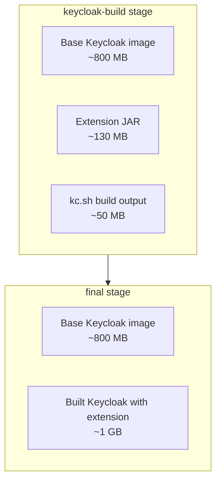

# Dockerfile Reference

Two-stage Dockerfile (`quick-starts/$images/keycloak/Dockerfile`) that builds the quick-start Keycloak image from the **packaged** extension jar. It is built with the repository root as context, and `target/kete.jar` must exist first:

```bash
mvn package -DskipTests
docker build -f "quick-starts/$images/keycloak/Dockerfile" -t keycloak:kete .
```

The root `.dockerignore` sends nothing but `target/kete.jar` to the daemon, so the image ships exactly the jar that was tested and released rather than a second build from source (which used to stamp `Implementation-Version: 0.0.0` and download every dependency again).


## Build Stages

### Stage 1: keycloak-build

**Base Image:** `quay.io/keycloak/keycloak:26.0.7`  
**Purpose:** Install the extension and build Keycloak

```dockerfile
FROM quay.io/keycloak/keycloak:26.0.7 AS keycloak-build
ENV KC_HEALTH_ENABLED=true
ENV KC_METRICS_ENABLED=true
COPY --chown=keycloak:keycloak target/kete.jar /opt/keycloak/providers/kete.jar
RUN /opt/keycloak/bin/kc.sh build --health-enabled=true --metrics-enabled=true
```

**What it does:**
1. Copies the packaged jar from the build context to `/opt/keycloak/providers/`
2. Runs `kc.sh build` to discover and register providers, optimize the configuration and build internal caches

**Output:** Optimized Keycloak installation with the extension


### Stage 2: final

**Base Image:** `quay.io/keycloak/keycloak:26.0.7`  
**Purpose:** Create the runtime image

```dockerfile
FROM quay.io/keycloak/keycloak:26.0.7 AS final
COPY --from=keycloak-build /opt/keycloak/ /opt/keycloak/
ENV KC_HTTP_ENABLED=true
ENV KC_HEALTH_ENABLED=true
ENV KC_METRICS_ENABLED=true
ENV kete.metrics.enabled=true
ENV KC_BOOTSTRAP_ADMIN_USERNAME=admin
ENV KC_BOOTSTRAP_ADMIN_PASSWORD=admin
ENTRYPOINT ["/opt/keycloak/bin/kc.sh"]
CMD ["start-dev"]
```

**What it does:**
1. Starts from a fresh Keycloak base image
2. Copies only the built Keycloak directory from `keycloak-build`
3. Enables HTTP, health and metrics endpoints, KETE metrics, and the demo `admin`/`admin` bootstrap account
4. Starts Keycloak in dev mode by default

**Result:** Clean image without build artifacts


## Build Process

### Manual Build

```bash
mvn package -DskipTests
docker build -f "quick-starts/$images/keycloak/Dockerfile" -t keycloak:kete .
```

### Build with Script

`run-on-pull-request-push.ps1` and `run-on-develop-push.ps1` package the jar, run [`run-jar-check.ps1`](scripts/run-jar-check.md) and build the image (validation only); `run-on-release-push.ps1` does the same and pushes the versioned and `:latest` tags — see [Scripts](scripts/overview.md).

### Build with Specific Version

The Dockerfile pins the Keycloak version in its `FROM` lines; to build against another version, edit those lines (there is no `ARG`).


## Image Layers



The shaded jar bundles every destination client library (~130 MB), which is what makes the final image noticeably larger than the base Keycloak image.


## Customization

### Change Keycloak Version

Edit the Dockerfile and update the version in both stages:

```dockerfile
FROM quay.io/keycloak/keycloak:27.0.0 AS keycloak-build
# ...
FROM quay.io/keycloak/keycloak:27.0.0 AS final
```

### Multi-Architecture Build

```bash
docker buildx build \
  --platform linux/amd64,linux/arm64 \
  -f "quick-starts/$images/keycloak/Dockerfile" \
  -t keycloak:kete \
  .
```

### Build Arguments

```dockerfile
ARG KEYCLOAK_VERSION=26.0.7

FROM quay.io/keycloak/keycloak:${KEYCLOAK_VERSION} AS keycloak-build
# ...
FROM quay.io/keycloak/keycloak:${KEYCLOAK_VERSION} AS final
```

```bash
docker build \
  --build-arg KEYCLOAK_VERSION=27.0.0 \
  -f "quick-starts/$images/keycloak/Dockerfile" \
  -t keycloak:custom \
  .
```


## Security

### Non-Root User

Keycloak runs as `keycloak:keycloak` (UID 1000):

```dockerfile
COPY --chown=keycloak:keycloak ...
```

### Scan for Vulnerabilities

```bash
# Using Docker Scout
docker scout cves keycloak:kete

# Using Trivy
trivy image keycloak:kete
```


## Troubleshooting

### `target/kete.jar` not found

The context only contains the packaged jar. Run `mvn package -DskipTests` (and `.\run-jar-check.ps1`) before `docker build`.

### Build Fails at Keycloak Build

**Error:** `kc.sh build` fails

**Solution:**
```bash
# Check logs
docker build --progress=plain -f "quick-starts/$images/keycloak/Dockerfile" -t keycloak:kete .

# Verify the jar registers the provider
jar tf target/kete.jar | grep META-INF/services
```

### Image Size Too Large

```bash
docker history keycloak:kete
```

The jar itself is ~130 MB because every destination client is bundled; the Keycloak base image accounts for the rest.


## .dockerignore

The root `.dockerignore` excludes everything except `target/kete.jar`:

```
*
!target/
target/*
!target/kete.jar
```

Without it the build context would be the whole repository (several hundred megabytes once `target/` holds test reports and both jars).


## Integration with CI/CD

### GitHub Actions

```yaml
- name: Package
  run: mvn package -DskipTests

- name: Build Docker Image
  run: docker build -f "quick-starts/$images/keycloak/Dockerfile" -t keycloak:kete .

- name: Push to Registry
  run: |
    docker tag keycloak:kete myregistry/keycloak:latest
    docker push myregistry/keycloak:latest
```

### GitLab CI

```yaml
docker-build:
  image: docker:latest
  services:
    - docker:dind
  script:
    - mvn package -DskipTests
    - docker build -f "quick-starts/$images/keycloak/Dockerfile" -t $CI_REGISTRY_IMAGE:$CI_COMMIT_SHA .
    - docker push $CI_REGISTRY_IMAGE:$CI_COMMIT_SHA
```
