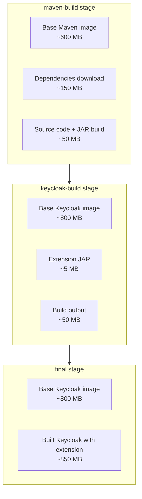

# Dockerfile Reference

Multi-stage Dockerfile for building Keycloak with the extension.


## Overview

This Dockerfile uses a multi-stage build to:
1. Build the extension JAR with Maven
2. Install the JAR into Keycloak
3. Create a minimal final image


## Build Stages

### Stage 1: maven-build

**Base Image:** `maven:3.9.9-eclipse-temurin-21-noble`  
**Purpose:** Build the extension JAR

```dockerfile
FROM maven:3.9.9-eclipse-temurin-21-noble AS maven-build
WORKDIR /src
COPY pom.xml .
RUN mvn -q -DskipTests dependency:go-offline
COPY . .
RUN mvn -B -DskipTests package
```

**What it does:**
1. Sets working directory to `/src`
2. Copies `pom.xml` (for dependency caching)
3. Downloads dependencies offline
4. Copies all source code
5. Builds JAR with `mvn package` (skips tests)

**Output:** `/src/target/kete.jar`


### Stage 2: keycloak-build

**Base Image:** `quay.io/keycloak/keycloak:26.0.0`  
**Purpose:** Install extension and build Keycloak

```dockerfile
FROM quay.io/keycloak/keycloak:26.0.0 AS keycloak-build
COPY --from=maven-build --chown=keycloak:keycloak /src/target/kete.jar /opt/keycloak/providers/kete.jar
RUN /opt/keycloak/bin/kc.sh build --verbose
```

**What it does:**
1. Copies JAR from maven-build stage to `/opt/keycloak/providers/`
2. Runs `kc.sh build` to:
   - Discover and register providers
   - Optimize Keycloak configuration
   - Build internal caches

**Output:** Optimized Keycloak installation with extension


### Stage 3: final

**Base Image:** `quay.io/keycloak/keycloak:26.0.0`  
**Purpose:** Create minimal runtime image

```dockerfile
FROM quay.io/keycloak/keycloak:26.0.0 AS final
COPY --from=keycloak-build /opt/keycloak/ /opt/keycloak/
```

**What it does:**
1. Starts with fresh Keycloak base image
2. Copies only the built Keycloak directory from keycloak-build

**Result:** Clean image without build artifacts


## Build Process

### Manual Build

```bash
docker build -t keycloak:kete .
```

### Build with Script

```powershell
.\docker-build.ps1
```

### Build with Specific Version

```bash
docker build \
  --build-arg KEYCLOAK_VERSION=26.0.0 \
  -t keycloak:custom \
  .
```


## Image Layers

### Layer Breakdown



**Final image size:** ~850 MB


## Customization

### Change Keycloak Version

Edit the Dockerfile and update the version in all three stages:

```dockerfile
FROM quay.io/keycloak/keycloak:27.0.0 AS keycloak-build
# ...
FROM quay.io/keycloak/keycloak:27.0.0 AS final
```

### Change Maven Options

```dockerfile
# Enable tests
RUN mvn -B package

# Different profile
RUN mvn -B -Pproduction package

# Offline mode
RUN mvn -B -o package
```

### Multi-Architecture Build

```bash
docker buildx build \
  --platform linux/amd64,linux/arm64 \
  -t keycloak:kete \
  .
```


## Build Arguments

### Define Build Args

```dockerfile
ARG KEYCLOAK_VERSION=26.0.0
ARG MAVEN_VERSION=3.9.9

FROM maven:${MAVEN_VERSION}-eclipse-temurin-21-noble AS maven-build
# ...
FROM quay.io/keycloak/keycloak:${KEYCLOAK_VERSION} AS keycloak-build
```

### Pass at Build Time

```bash
docker build \
  --build-arg KEYCLOAK_VERSION=27.0.0 \
  --build-arg MAVEN_VERSION=3.9.13 \
  -t keycloak:custom \
  .
```


## Performance Optimization

### Build Cache

**Optimize layer caching:**
```dockerfile
# Copy pom.xml first (rarely changes)
COPY pom.xml .
RUN mvn dependency:go-offline

# Copy source later (changes frequently)
COPY . .
RUN mvn package
```

### Parallel Builds

```dockerfile
RUN mvn -B -T 1C package  # One thread per CPU core
```

### Reduce Image Size

```dockerfile
# Use alpine variants
FROM maven:3.9.9-eclipse-temurin-21-alpine AS maven-build

# Remove unnecessary files
RUN rm -rf /opt/keycloak/lib/lib/community/*.jar
```


## Security

### Non-Root User

Keycloak runs as `keycloak:keycloak` (UID 1000):

```dockerfile
COPY --chown=keycloak:keycloak ...
```

### Scan for Vulnerabilities

```bash
# Using Docker Scout
docker scout cves keycloak:kete

# Using Trivy
trivy image keycloak:kete
```


## Troubleshooting

### Build Fails at Maven Stage

**Error:** Dependencies download fails

**Solution:**
```bash
# Check internet connection
ping repo.maven.apache.org

# Use local Maven repo
docker build \
  -v ~/.m2:/root/.m2 \
  -t keycloak:kete \
  .
```

### Build Fails at Keycloak Build

**Error:** `kc.sh build` fails

**Solution:**
```bash
# Check logs
docker build --progress=plain -t keycloak:kete .

# Verify JAR is valid
jar tf target/kete.jar | grep META-INF/services
```

### Image Size Too Large

**Check layer sizes:**
```bash
docker history keycloak:kete
```

**Optimize:**
- Use alpine base images
- Minimize COPY operations
- Combine RUN commands
- Use .dockerignore


## .dockerignore

Create `.dockerignore` to exclude files:

```
.git
.github
target/
.idea/
*.iml
.vscode/
docs/
*.md
LICENSE
.gitignore
docker-*.ps1
```


## Integration with CI/CD

### GitHub Actions

```yaml
- name: Build Docker Image
  run: docker build -t keycloak:kete .

- name: Push to Registry
  run: |
    docker tag keycloak:kete myregistry/keycloak:latest
    docker push myregistry/keycloak:latest
```

### GitLab CI

```yaml
docker-build:
  image: docker:latest
  services:
    - docker:dind
  script:
    - docker build -t $CI_REGISTRY_IMAGE:$CI_COMMIT_SHA .
    - docker push $CI_REGISTRY_IMAGE:$CI_COMMIT_SHA
```
