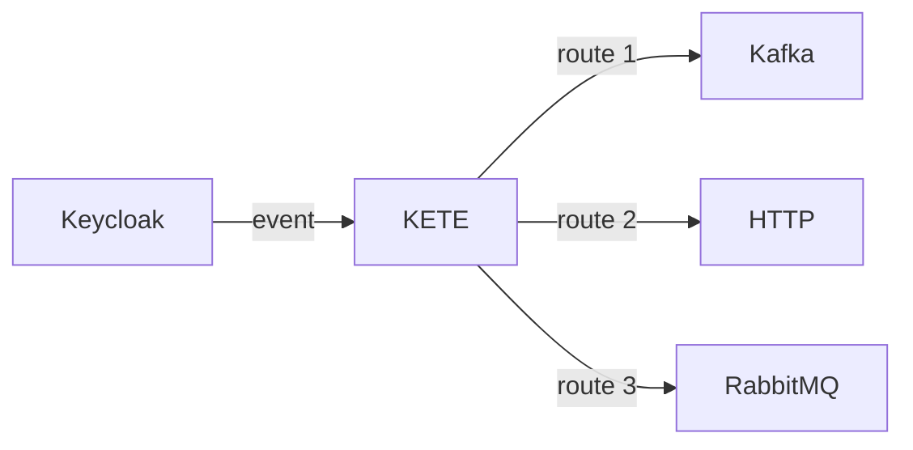
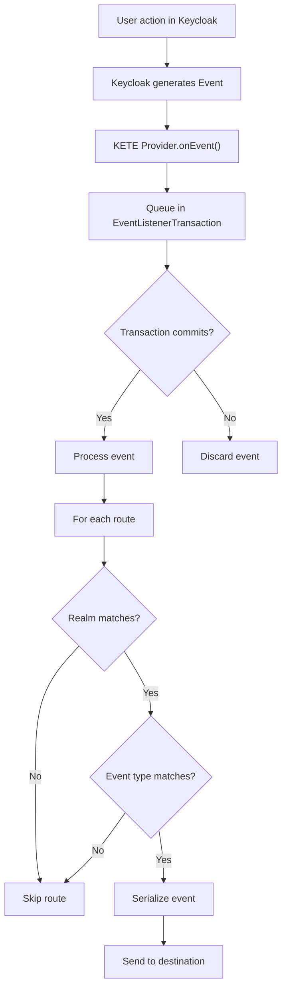
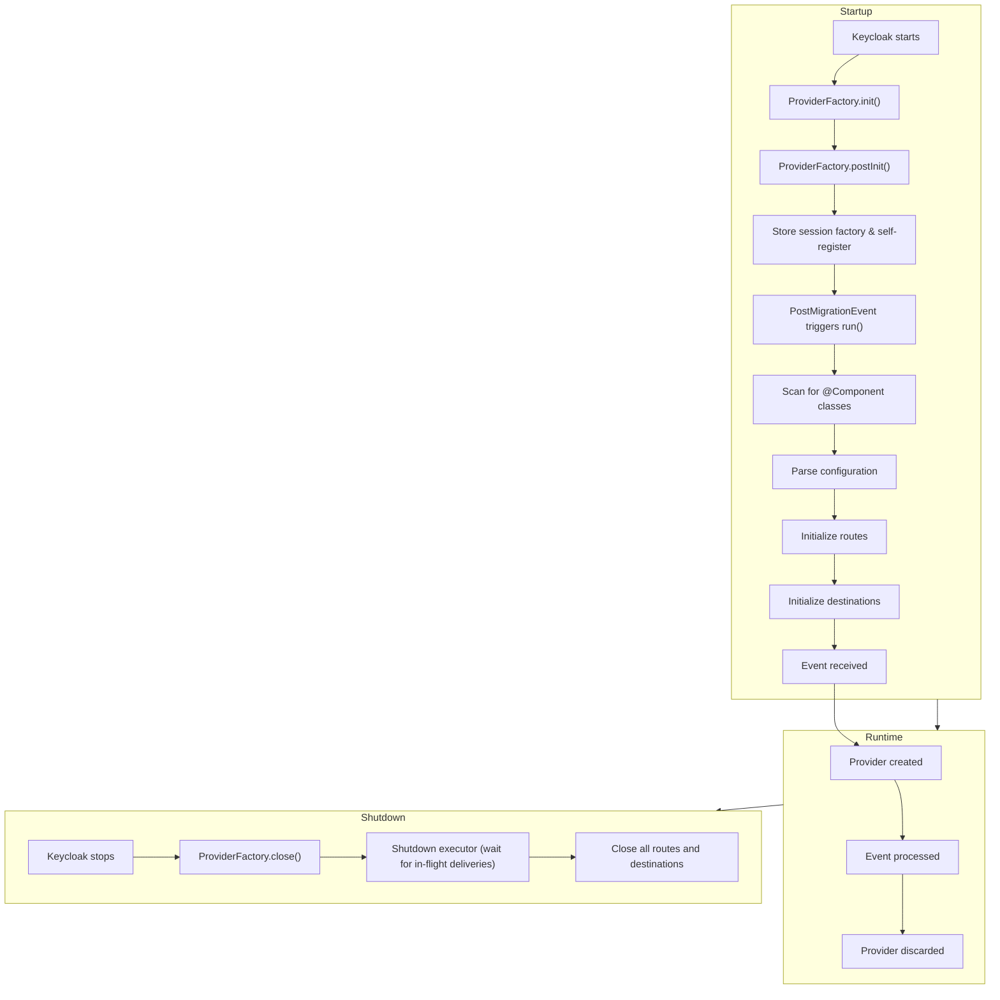
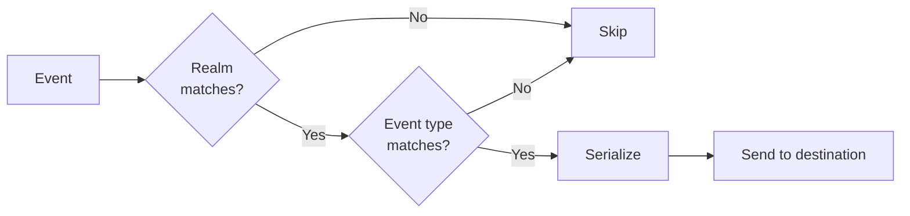
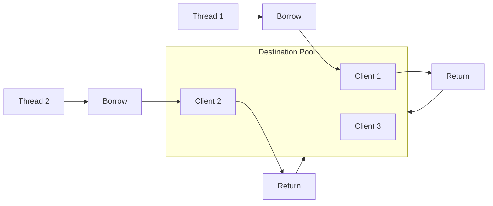

# How KETE Works

Visual guide to KETE's event processing. For detailed technical information, see [Architecture](architecture.md).

---

## The Big Picture

KETE plugs into Keycloak's Event Listener SPI. When something happens in Keycloak (login, user created, etc.), Keycloak fires an event. KETE catches that event and routes it to configured destinations.

---

## Event Processing Flow

### User Events (LOGIN, LOGOUT, etc.)

### Admin Events (USER_CREATE, REALM_UPDATE, etc.)

Same flow but uses `onEvent(AdminEvent, boolean)` and the event type is `RESOURCETYPE_OPERATIONTYPE` (e.g. `USER_CREATE`).

---

## Component Lifecycle

---

## Route Matching

Each route has realm matchers and event matchers:

### Match Modes

- **ANY** (default): Accept if ANY matcher matches (OR)
- **ALL**: Accept only if ALL matchers match (AND)

---

## Destination Pooling

All destinations use Apache Commons Pool2:

Pool sizes are configurable per route:
- `pool.min-idle`: Default 1
- `pool.max-idle`: Default 10
- `pool.max-total`: Default 20

---

## Key Design Decisions

| Decision | Rationale |
|----------|-----------|
| **Transaction-aware** | Events only published after Keycloak transaction commits |
| **Virtual threads** | Parallel destination delivery without blocking |
| **Destination pooling** | Predictable resource usage, virtual thread compatibility |
| **Matcher caching** | O(1) lookup after first match per event type |
| **Serializer singletons** | One instance shared across routes (except `template`, `multipart-form` and `url-encoded-form`, which are transient) |

---

## Error Handling

| Error Type | Behavior |
|------------|----------|
| Destination connection failure | Logged, route skipped |
| Serialization error | Logged, affects all routes using that serializer |
| Matcher evaluation error | Logged as a send failure (`kete.events.failed.total`); the event is skipped for that route |
| Message send failure | Retry if configured, otherwise logged |

---

## See Also

- [Architecture](architecture.md) — Detailed technical design
- [Configuration](configuration.md) — All configuration options
- [Transaction Support](transaction-support.md) — Transaction handling details
