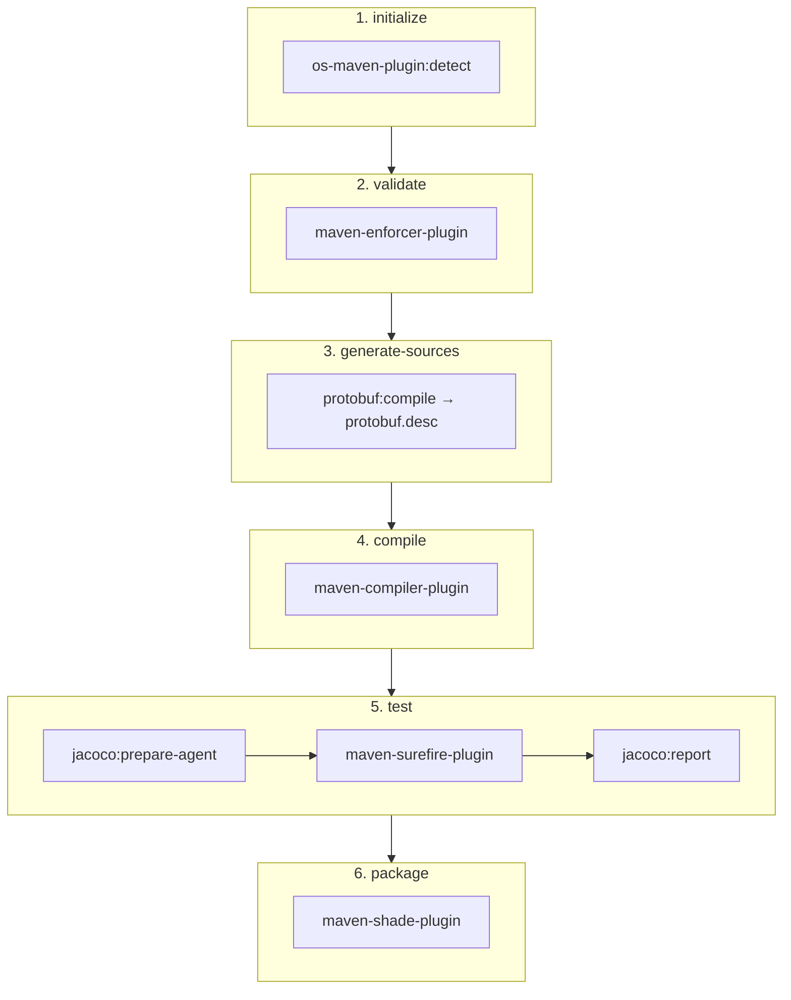

# Maven Plugins Configuration

Maven plugins used in the build.

## Plugins

| Plugin | Version | Purpose |
|--------|---------|---------|
| os-maven-plugin | 1.7.1 | Build extension; detects the OS classifier used to select the `protoc` binary |
| maven-compiler-plugin | 3.13.0 | Compiles Java 21 source with Lombok |
| maven-enforcer-plugin | 3.6.2 | Enforces Maven 3.9.0+ and Java 21+ |
| protobuf-maven-plugin | 0.6.1 | Compiles `schemas/protobuf/*.proto` with protoc 4.33.2 into the descriptor set `target/classes/schemas/protobuf/protobuf.desc` (no Java code generation is used) |
| maven-surefire-plugin | 3.5.4 | Runs tests (all categories; scripts filter with `-Dtest`) |
| jacoco-maven-plugin | 0.8.13 | Generates coverage reports (XML, CSV, HTML) |
| maven-shade-plugin | 3.6.1 | Creates the relocated uber-JAR |

`schemas/avro/*.avsc` are packaged as resources under `schemas/avro/` and loaded at runtime by the Avro serializer.

## Test Directories

The build uses the standard Maven test directory structure:

- `src/test/java` - Test source code
- `src/test/resources` - Test resources

## Uber-JAR

The `maven-shade-plugin` creates a single JAR (`kete.jar`) containing all dependencies, relocated under `kete.*` (98 relocations). Transformers: `ServicesResourceTransformer` (merges `META-INF/services`), `ManifestResourceTransformer` (Implementation-Title/Version, Build-Timestamp, Build-Jdk), `ApacheLicenseResourceTransformer` and `ApacheNoticeResourceTransformer`. Filters strip `module-info.class`, signature files and `META-INF/maven/**` from dependencies.

## Coverage Reports

After running tests, coverage reports are generated at `target/site/jacoco/` (`index.html`, `jacoco.xml`, `jacoco.csv` — the CSV feeds the README coverage badge).

## Build Lifecycle

