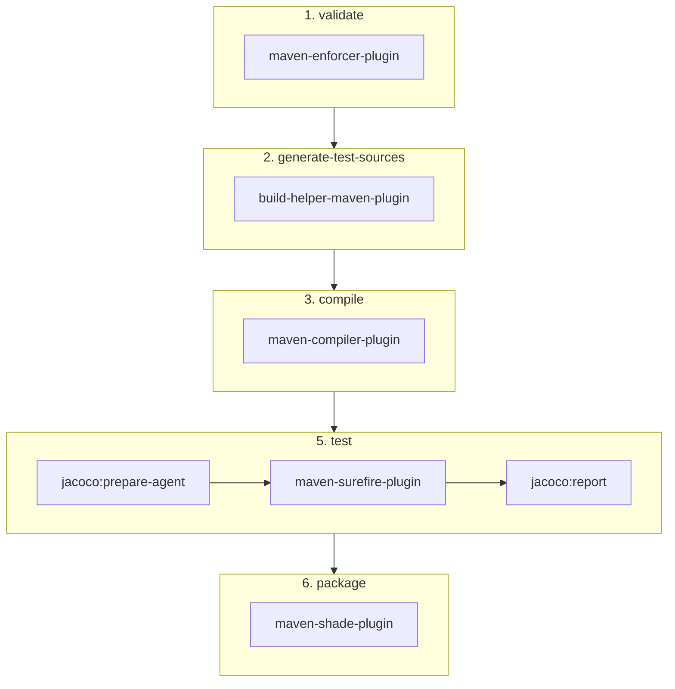

# Maven Plugins Configuration

Maven plugins used in the build.

## Plugins

| Plugin | Version | Purpose |
|--------|---------|---------|
| maven-compiler-plugin | 3.11.0 | Compiles Java 21 source with Lombok |
| build-helper-maven-plugin | 3.6.0 | Adds custom test directories |
| maven-enforcer-plugin | 3.6.2 | Enforces Maven 3.9.0+ |
| maven-surefire-plugin | 3.5.2 | Runs tests |
| jacoco-maven-plugin | 0.8.14 | Generates coverage reports |
| maven-shade-plugin | 3.6.0 | Creates uber-JAR |

## Test Directories

The build uses custom test directory structure:

- `src/tests/java` - Test source code
- `src/tests/resources` - Test resources

These are registered via `build-helper-maven-plugin`.

## Uber-JAR

The `maven-shade-plugin` creates a single JAR (`kete.jar`) containing all dependencies. The `ServicesResourceTransformer` merges `META-INF/services` files from dependencies.

## Coverage Reports

After running tests, coverage reports are generated at `target/site/jacoco/index.html`.

## Build Lifecycle

