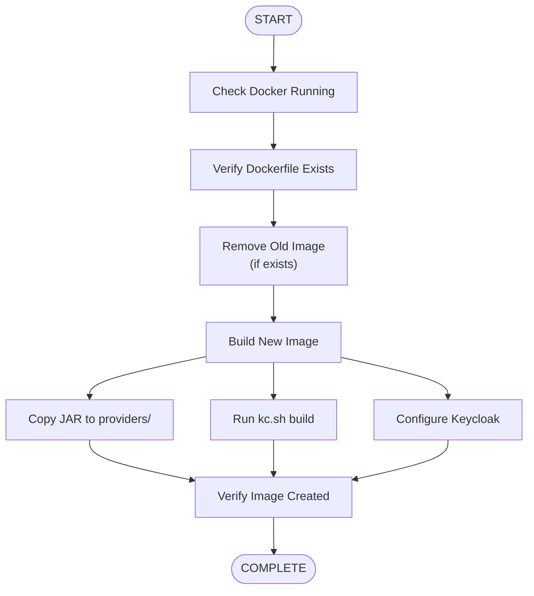

# docker-build.ps1

**Purpose:** Build Keycloak Docker image with the extension  
**Platform:** Windows PowerShell  
**Output:** `keycloak:hephaestus` Docker image


## What You'll Learn

- How to build a custom Keycloak Docker image
- Understanding the build process
- Troubleshooting build failures
- Image verification


## Quick Start

**Basic usage:**

```powershell
.\docker-build.ps1
```

**What it does:**
1. Checks Docker is running
2. Verifies Dockerfile exists
3. Removes old images
4. Builds new image with extension
5. Verifies build success


## Prerequisites

- Docker Desktop running
- PowerShell 5.1 or later
- Dockerfile in project root
- Built JAR file (run `mvn clean package` first)


## How It Works

### Build Flow



### Image Configuration

The script reads from `pom.xml`:
- **artifactId** → Used as image tag
- Creates image: `keycloak:hephaestus`
- Based on official Keycloak image


## Usage Examples

### Example 1: Standard Build

```powershell
# Build after Maven package
mvn clean package
.\docker-build.ps1
```

**Output:**
```
[10:30:15] ✓ Docker is running
[10:30:15] ✓ Dockerfile found
[10:30:16] ▶ Building image: keycloak:hephaestus
[10:30:45] ✓ Image built successfully
```

### Example 2: Rebuild After Code Changes

```powershell
# Make code changes
mvn clean package
.\docker-build.ps1
```

The script automatically removes the old image before building.

### Example 3: Verify Build

```powershell
# After build, check image
docker images keycloak:hephaestus

# Inspect image details
docker inspect keycloak:hephaestus
```


## Script Functions

### Check Docker Running

Verifies Docker daemon is accessible:
- Windows: Docker Desktop must be running
- Linux: `systemctl status docker`
- macOS: Docker Desktop must be running

### Remove Old Images

Automatically removes previous build:
- Finds image by name
- Force removes with `docker rmi -f`
- Continues even if removal fails (image in use)

### Build Process

Executes Docker build with:
- Context: Project root
- Dockerfile: `./Dockerfile`
- Tag: `keycloak:hephaestus`
- No cache option available


## Configuration

### Image Name

Set in script variables:
```powershell
$ImageName = "keycloak"
$ImageTag = $artifactId  # From pom.xml
$FullImageName = "${ImageName}:${ImageTag}"
```

### Build Context

```powershell
$DockerfilePath = "Dockerfile"  # Root directory
```


## Troubleshooting

### Issue: Docker not running

**Error:** "Docker is not running"

**Solution:**
```powershell
# Windows
Start-Process "Docker Desktop"

# Linux
sudo systemctl start docker

# Verify
docker info
```

### Issue: Dockerfile not found

**Error:** "Dockerfile not found"

**Solution:**
```powershell
# Ensure you're in project root
cd C:\path\to\kete

# Verify Dockerfile exists
Test-Path Dockerfile

# Run build
.\docker-build.ps1
```

### Issue: Build fails - JAR not found

**Error:** Build fails during COPY step

**Solution:**
```powershell
# Build JAR first
mvn clean package

# Verify JAR exists
Test-Path target\*.jar

# Then build image
.\docker-build.ps1
```

### Issue: Old image in use

**Warning:** "Could not remove previous image (may be in use)"

**Solution:**
```powershell
# Stop containers using the image
docker ps -a | Select-String "keycloak:hephaestus"
docker stop <container_id>
docker rm <container_id>

# Rebuild
.\docker-build.ps1
```


## Output Messages

### Success Messages

| Message | Meaning |
|---------|---------|
| `✓ Docker is running` | Docker daemon accessible |
| `✓ Dockerfile found` | Dockerfile exists in expected location |
| `✓ Image built successfully` | Build Completed without errors |

### Warning Messages

| Message | Meaning |
|---------|---------|
| ` Removing existing image` | Old image found, removing it |
| ` Could not remove previous image` | Old image in use by container |

### Error Messages

| Message | Meaning |
|---------|---------|
| `✗ Docker is not running` | Docker daemon not accessible |
| `✗ Dockerfile not found` | Dockerfile missing |
| `✗ Build failed` | Docker build command failed |


## Advanced Usage

### Custom Image Name

Edit script to change image name:

```powershell
# Open script
notepad .\docker-build.ps1

# Modify these lines:
$ImageName = "my-keycloak"  # Change this
$ImageTag = "custom-tag"     # Change this
```

### Build with Different Dockerfile

```powershell
# In script, change:
$DockerfilePath = "Dockerfile.custom"
```


## Integration with CI/CD

### GitHub Actions

```yaml
- name: Build Docker Image
  run: |
    mvn clean package
    pwsh -File docker-build.ps1
  shell: pwsh
```

### GitLab CI

```yaml
build-image:
  script:
    - mvn clean package
    - pwsh -File docker-build.ps1
```
