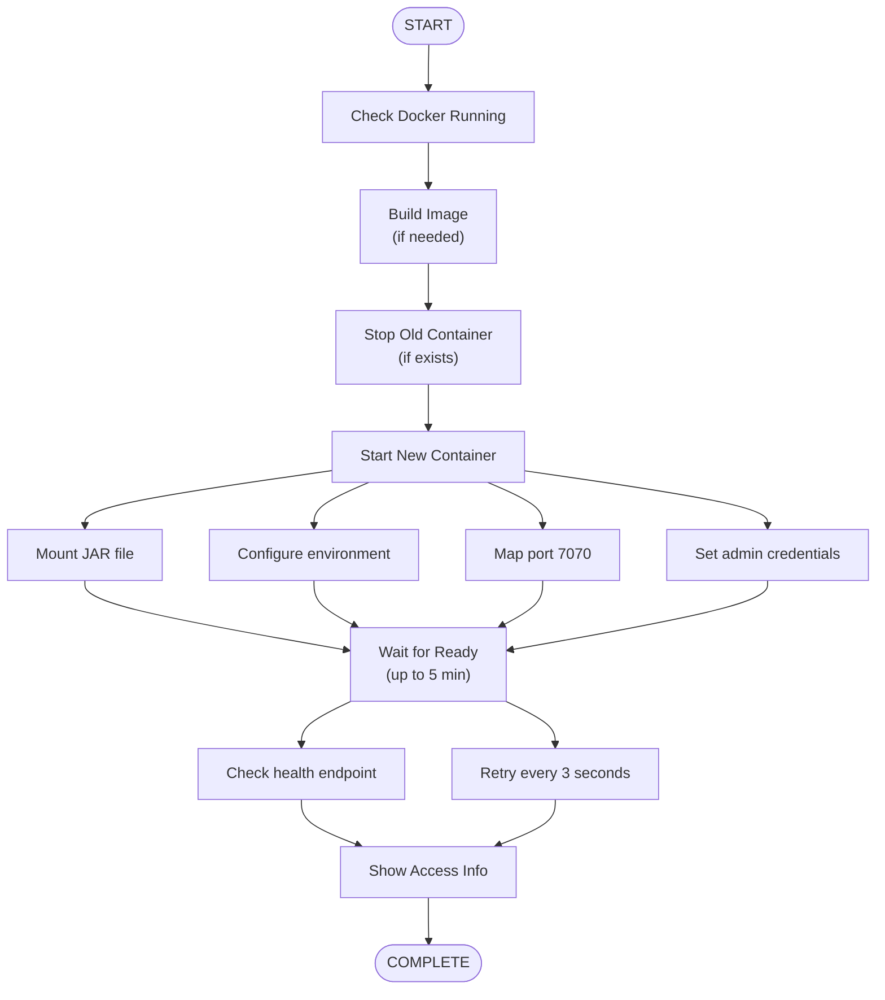

# docker-run.ps1

**Purpose:** Run Keycloak container with the extension  
**Platform:** Windows PowerShell  
**Container:** `keycloak-hephaestus` on port 7070


## What You'll Learn

- How to run Keycloak with the extension
- Container lifecycle management
- Health checking and readiness
- Accessing Keycloak admin console


## Quick Start

**Basic usage:**

```powershell
.\docker-run.ps1
```

**What it does:**
1. Builds image (calls docker-build.ps1)
2. Stops existing container
3. Starts new container
4. Waits for Keycloak to be ready
5. Shows access information


## Prerequisites

- Docker Desktop running
- PowerShell 5.1 or later
- Built extension JAR
- Available port 7070


## How It Works

### Execution Flow



### Container Configuration

```powershell
Container: keycloak-hephaestus
Port: 7070 (host) → 8080 (container)
Admin: admin/admin
Health Check: http://localhost:7070/health/ready
```


## Usage Examples

### Example 1: First Run

```powershell
# Build and run
.\docker-run.ps1
```

**Output:**
```
[10:45:00] ✓ Docker is running
[10:45:01] ▶ Building image...
[10:45:30] ✓ Image ready
[10:45:31] ▶ Starting container...
[10:46:15] ✓ Container started
[10:46:15] ▶ Waiting for Keycloak...
[10:46:45] ✓ Keycloak is ready!

╔════════════════════════════════════════╗
║     Keycloak is Ready                  ║
╠════════════════════════════════════════╣
║ Admin Console:                         ║
║   http://localhost:7070                ║
║                                        ║
║ Credentials:                           ║
║   Username: admin                      ║
║   Password: admin                      ║
╚════════════════════════════════════════╝
```

### Example 2: Restart After Changes

```powershell
# Make code changes
mvn clean package

# Restart (rebuilds automatically)
.\docker-run.ps1
```

### Example 3: Check Container Status

```powershell
# View running container
docker ps -a | Select-String "keycloak"

# View logs
docker logs keycloak-hephaestus

# Follow logs
docker logs -f keycloak-hephaestus
```


## Configuration

### Port Settings

Default port: **7070**

Change in script:
```powershell
$HttpPort = 7070  # Change to desired port
```

Or use environment variable:
```powershell
$env:KEYCLOAK_HTTP_PORT = "8080"
.\docker-run.ps1
```

### Admin Credentials

Default: `admin/admin`

Container environment variables:
```powershell
-e KEYCLOAK_ADMIN=admin
-e KEYCLOAK_ADMIN_PASSWORD=admin
```

### Timeout

Default: 300 seconds (5 minutes)

Change in script:
```powershell
$TIMEOUT_SECONDS = 600  # 10 minutes
```


## Health Checking

### Health Endpoint

The script polls Keycloak's health endpoint:

```
http://localhost:7070/health/ready
```

**Ready criteria:**
- Returns HTTP 200
- Database connected
- Extensions loaded
- Server started

### Manual Health Check

```powershell
# Check health
Invoke-WebRequest -Uri "http://localhost:7070/health/ready"

# Check with curl
curl http://localhost:7070/health/ready
```


## Environment Variables

### Default Environment

The container runs with:

```bash
KEYCLOAK_ADMIN=admin
KEYCLOAK_ADMIN_PASSWORD=admin
KC_HTTP_PORT=8080
KC_HOSTNAME_STRICT=false
KC_PROXY=edge
KC_HEALTH_ENABLED=true
KC_METRICS_ENABLED=true
```

### Adding Custom Variables

Edit the script to add:

```powershell
docker run `
  -e kete.routes.kafka-example.destination.kind=kafka `
  -e kete.routes.kafka-example.destination.bootstrap.servers=kafka:9092 `
  # ... other Parameters
```


## Troubleshooting

### Issue: Port already in use

**Error:** "Port 7070 is already allocated"

**Solution:**
```powershell
# Find process using port
Get-NetTCPConnection -LocalPort 7070

# Stop old container
docker stop keycloak-hephaestus
docker rm keycloak-hephaestus

# Or change port
$HttpPort = 8080
.\docker-run.ps1
```

### Issue: Timeout waiting for Keycloak

**Error:** "Timeout waiting for Keycloak"

**Solution:**
```powershell
# Check container logs
docker logs keycloak-hephaestus

# Check if container is running
docker ps -a

# Increase timeout
# Edit script: $TIMEOUT_SECONDS = 600
```

### Issue: Container exits immediately

**Error:** Container starts but exits

**Solution:**
```powershell
# View container logs
docker logs keycloak-hephaestus

# Common causes:
# - Missing JAR file
# - Invalid configuration
# - Database connection issues

# Verify JAR exists
Test-Path target\*.jar

# Check container exit code
docker ps -a --filter "name=keycloak-hephaestus" --format "{{.Status}}"
```

### Issue: Cannot access admin console

**Error:** Browser can't connect to http://localhost:7070

**Solution:**
```powershell
# Verify container is running
docker ps | Select-String "keycloak"

# Check port mapping
docker port keycloak-hephaestus

# Verify health endpoint
curl http://localhost:7070/health/ready

# Check firewall
Test-NetConnection -ComputerName localhost -Port 7070
```


## Advanced Usage

### Run Without Building

To skip automatic build:

```powershell
# Comment out build step in script
# Or manually run:
docker run -d `
  --name keycloak-hephaestus `
  -p 7070:8080 `
  -e KEYCLOAK_ADMIN=admin `
  -e KEYCLOAK_ADMIN_PASSWORD=admin `
  keycloak:hephaestus
```

### Mount Custom Configuration

```powershell
docker run -d `
  --name keycloak-hephaestus `
  -p 7070:8080 `
  -v ${PWD}/keycloak.conf:/opt/keycloak/conf/keycloak.conf `
  keycloak:hephaestus
```

### Connect to Infrastructure

```powershell
# Start infrastructure first
.\docker-infra.ps1 start

# Run Keycloak with network access
docker run -d `
  --name keycloak-hephaestus `
  --network keycloak-network `
  -p 7070:8080 `
  -e kete.routes.kafka-example.destination.kind=kafka `
  -e kete.routes.kafka-example.destination.bootstrap.servers=kafka:9092 `
  keycloak:hephaestus
```


## Container Management

### Stop Container

```powershell
docker stop keycloak-hephaestus
```

### Start Container

```powershell
docker start keycloak-hephaestus
```

### Restart Container

```powershell
docker restart keycloak-hephaestus
```

### Remove Container

```powershell
docker stop keycloak-hephaestus
docker rm keycloak-hephaestus
```

### View Logs

```powershell
# All logs
docker logs keycloak-hephaestus

# Last 100 lines
docker logs --tail 100 keycloak-hephaestus

# Follow logs
docker logs -f keycloak-hephaestus

# With timestamps
docker logs -t keycloak-hephaestus
```


## Integration Testing

### Run Tests Against Container

```powershell
# Start Keycloak
.\docker-run.ps1

# Wait for ready (automatic)

# Run tests
mvn test

# Or run UI tests
.\docker-ui-test.ps1
```
