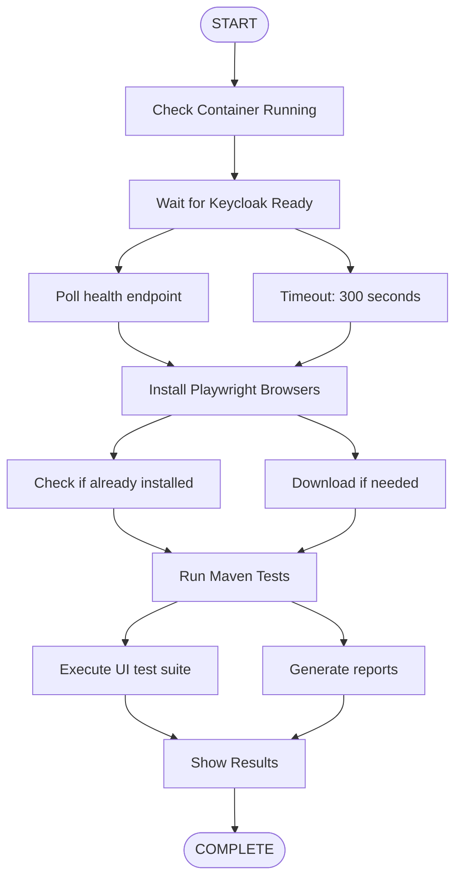

# docker-ui-test.ps1

**Purpose:** Run Playwright UI tests against containerized Keycloak  
**Platform:** Windows PowerShell  
**Tests:** Browser-based integration tests


## What You'll Learn

- How to run UI tests against Keycloak
- Playwright browser automation
- Container readiness verification
- Test execution and results


## Quick Start

**Basic usage:**

```powershell
.\docker-ui-test.ps1
```

**What it does:**
1. Checks container is running
2. Waits for Keycloak ready
3. Installs Playwright browsers (if needed)
4. Runs Maven UI tests
5. Shows test results


## Prerequisites

- Keycloak container running (`.\docker-run.ps1`)
- PowerShell 5.1 or later
- Maven installed
- Java 21 or later
- Internet connection (for browser download)


## How It Works

### Execution Flow



### Test Configuration

```powershell
Container: keycloak-hephaestus
Port: 7070
Timeout: 300 seconds (5 minutes)
Health Endpoint: http://localhost:7070/health/ready
```


## Usage Examples

### Example 1: Standard Test Run

```powershell
# Start Keycloak
.\docker-run.ps1

# Run UI tests
.\docker-ui-test.ps1
```

**Output:**
```
[→] Checking container status...
[✓] Container is running
[→] Waiting for Keycloak to be ready...
[✓] Keycloak is ready!
[→] Installing Playwright browsers...
[✓] Playwright browsers already installed
[→] Running UI tests...

[INFO] Running tests...
[INFO] Tests run: 15, Failures: 0, Errors: 0, Skipped: 0

[✓] All tests passed!
```

### Example 2: First Run (Browser Install)

```powershell
.\docker-ui-test.ps1
```

**Output:**
```
[→] Checking container status...
[✓] Container is running
[→] Waiting for Keycloak to be ready...
[✓] Keycloak is ready!
[→] Installing Playwright browsers...
[→] Downloading Chromium...
[→] Downloading Firefox...
[→] Downloading WebKit...
[✓] Playwright browsers installed successfully
[→] Running UI tests...
```

### Example 3: Full Workflow

```powershell
# Build, run, and test
mvn clean package
.\docker-build.ps1
.\docker-run.ps1
.\docker-ui-test.ps1
```


## Test Suite

### What Gets Tested

The UI test suite typically includes:

**Authentication Tests:**
- Login flow
- Logout flow
- Failed login handling
- Session management

**Admin Console Tests:**
- Realm configuration
- User management
- Client configuration
- Event listener verification

**Extension Tests:**
- Extension loaded correctly
- Event listeners registered
- Configuration applied
- Destinations functional


## Playwright Browsers

### Browser Installation

First run installs:
- **Chromium** - ~100 MB
- **Firefox** - ~80 MB  
- **WebKit** - ~70 MB

**Installation location:**
```
Windows: %USERPROFILE%\.cache\ms-playwright
Linux: ~/.cache/ms-playwright
macOS: ~/Library/Caches/ms-playwright
```

### Manual Installation

```powershell
# Using Maven
mvn exec:java `
  -Dexec.mainClass=com.microsoft.playwright.CLI `
  -Dexec.args="install"

# Or using Playwright CLI
npx playwright install
```


## Configuration

### Timeout Settings

Default: 300 seconds (5 minutes)

Change in script:
```powershell
$TimeoutSeconds = 600  # 10 minutes
```

### Port Settings

Default: 7070

Change in script:
```powershell
$HttpPort = 8080  # Different port
```

### Container Name

Default: `keycloak-hephaestus`

Change in script:
```powershell
$ContainerName = "my-keycloak"
```


## Troubleshooting

### Issue: Container not running

**Error:** "Container is not running"

**Solution:**
```powershell
# Start Keycloak
.\docker-run.ps1

# Verify it's running
docker ps | Select-String "keycloak"

# Then run tests
.\docker-ui-test.ps1
```

### Issue: Timeout waiting for Keycloak

**Error:** "Timeout waiting for Keycloak"

**Solution:**
```powershell
# Check container logs
docker logs keycloak-hephaestus

# Check health manually
curl http://localhost:7070/health/ready

# Increase timeout
# Edit script: $TimeoutSeconds = 600
```

### Issue: Browser download fails

**Error:** "Failed to install Playwright browsers"

**Solution:**
```powershell
# Check internet connection
Test-NetConnection www.google.com

# Install manually
mvn exec:java `
  -Dexec.mainClass=com.microsoft.playwright.CLI `
  -Dexec.args="install"

# Clear cache and retry
Remove-Item -Recurse "$env:USERPROFILE\.cache\ms-playwright"
.\docker-ui-test.ps1
```

### Issue: Tests fail

**Error:** Test failures reported

**Solution:**
```powershell
# View detailed test output
mvn test -Dtest=UITest

# Check test reports
# target/surefire-reports/

# View screenshots (if enabled)
# target/screenshots/

# Check Keycloak logs
docker logs keycloak-hephaestus
```

### Issue: Port mismatch

**Error:** Tests can't connect

**Solution:**
```powershell
# Ensure port matches
# Script: $HttpPort = 7070
# Keycloak: Started on port 7070
# Test config: points to localhost:7070

# Check test configuration
cat src/test/resources/playwright.properties
```


## Test Results

### Result Locations

```
target/
├── surefire-reports/           # Test results
│   ├── TEST-*.xml             # JUnit XML
│   └── *.txt                  # Text reports
├── screenshots/               # Failure screenshots
└── videos/                    # Test recordings (if enabled)
```

### View Reports

```powershell
# View text report
Get-Content target\surefire-reports\*.txt

# View XML report
Get-Content target\surefire-reports\TEST-*.xml

# Open in browser (if HTML report generated)
Start-Process target\site\surefire-report.html
```


## Advanced Usage

### Run Specific Tests

```powershell
# Edit script to run specific test
mvn test -Dtest=LoginTest

# Or run test class
mvn test -Dtest=AdminUITest
```

### Debug Mode

```powershell
# Run with debug output
mvn test -X

# Run with Playwright debug
$env:PWDEBUG=1
mvn test
```

### Headed Mode

To see browser UI:

```powershell
# Set environment variable
$env:HEADLESS=false
mvn test
```

### Record Videos

Enable in test configuration:
```java
BrowserContext context = browser.newContext(new Browser.NewContextOptions()
    .setRecordVideoDir(Paths.get("target/videos")));
```


## Integration with CI/CD

### GitHub Actions

```yaml
- name: Run UI Tests
  run: |
    pwsh -File docker-run.ps1
    pwsh -File docker-ui-test.ps1
  shell: pwsh

- name: Upload Test Results
  if: always()
  uses: actions/upload-artifact@v3
  with:
    name: test-results
    path: target/surefire-reports/
```

### GitLab CI

```yaml
ui-tests:
  script:
    - pwsh -File docker-run.ps1
    - pwsh -File docker-ui-test.ps1
  artifacts:
    when: always
    reports:
      junit: target/surefire-reports/TEST-*.xml
```
