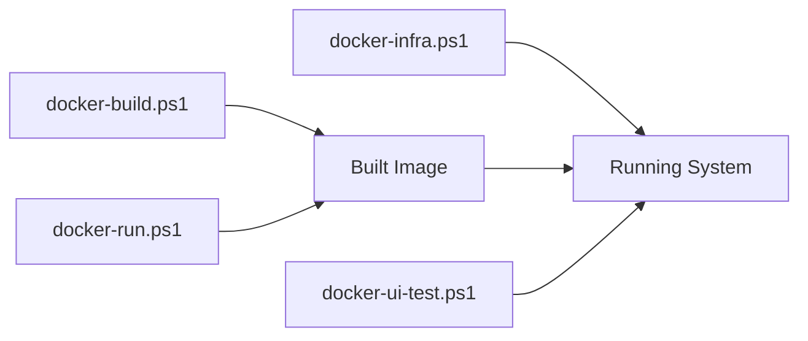

# Scripts

PowerShell automation scripts for building, running, and testing Keycloak with the extension.


## Available Scripts

| Script | Purpose | Guide |
|--------|---------|-------|
| **docker-build.ps1** | Build Docker image with extension | [Guide →](docker-build.md) |
| **docker-run.ps1** | Run Keycloak container | [Guide →](docker-run.md) |
| **docker-infra.ps1** | Manage Kafka/RabbitMQ infrastructure | [Guide →](docker-infra.md) |
| **docker-ui-test.ps1** | Run Playwright UI tests | [Guide →](docker-ui-test.md) |


## Quick Reference

### Complete Development Workflow

```powershell
# 1. Build extension
mvn clean package

# 2. Build Docker image
.\docker-build.ps1

# 3. Start infrastructure
.\docker-infra.ps1 start

# 4. Run Keycloak
.\docker-run.ps1

# 5. Run tests
.\docker-ui-test.ps1
```

### Quick Test Cycle

```powershell
# Make code changes...
mvn clean package
.\docker-build.ps1
.\docker-run.ps1
```

### Infrastructure Management

```powershell
# Start services
.\docker-infra.ps1 start

# Check status
.\docker-infra.ps1 status

# View logs
.\docker-infra.ps1 logs kafka

# Stop services
.\docker-infra.ps1 stop
```


## Script Dependencies




## Common Tasks

### Task 1: Initial Setup

First time setting up the project:

```powershell
# Clone repository
git clone https://github.com/FortuneN/kete.git
cd kete

# Build extension
mvn clean package

# Build image
.\docker-build.ps1

# Start everything
.\docker-infra.ps1 start
.\docker-run.ps1
```

**Access Keycloak:** http://localhost:7070 (admin/admin)

### Task 2: Development Cycle

Making and testing changes:

```powershell
# 1. Make code changes
# 2. Rebuild
mvn clean package
.\docker-build.ps1

# 3. Restart Keycloak
.\docker-run.ps1

# 4. Test
.\docker-ui-test.ps1
```

### Task 3: Test Integration

Testing with Kafka/RabbitMQ:

```powershell
# 1. Start infrastructure
.\docker-infra.ps1 start

# 2. Start Keycloak with config
# Edit environment variables in docker-run.ps1
.\docker-run.ps1

# 3. Test events
# Login to Keycloak
# Check Kafka/RabbitMQ received events
```

### Task 4: Clean Restart

Fresh start with clean state:

```powershell
# Stop everything
.\docker-infra.ps1 stop
docker stop keycloak-hephaestus
docker rm keycloak-hephaestus

# Clean volumes
.\docker-infra.ps1 clean

# Rebuild and restart
mvn clean package
.\docker-build.ps1
.\docker-infra.ps1 start
.\docker-run.ps1
```


## Prerequisites

### Required Software

- **Docker Desktop** - Container runtime
- **PowerShell 5.1+** - Script execution
- **Maven 3.6+** - Build tool
- **Java 21+** - Development kit

### Verify Prerequisites

```powershell
# Check Docker
docker --version
docker info

# Check PowerShell
$PSVersionTable.PSVersion

# Check Maven
mvn --version

# Check Java
java --version
```


## Environment Variables

### Keycloak Configuration

Set in docker-run.ps1 or pass to container:

```powershell
$env:KEYCLOAK_ADMIN = "admin"
$env:KEYCLOAK_ADMIN_PASSWORD = "admin"
$env:KEYCLOAK_HTTP_PORT = "7070"
```

### Extension Configuration

```powershell
${env:kete.routes.kafka.realm-matchers.filter} = "list:master"
${env:kete.routes.kafka.destination.kind} = "kafka"
${env:kete.routes.kafka.destination.bootstrap.servers} = "kafka:9092"
${env:kete.routes.kafka.destination.topic} = "keycloak-events"
```


## Troubleshooting

### Issue: Scripts Won't Run

**Error:** "Execution policy"

**Solution:**
```powershell
# Check policy
Get-ExecutionPolicy

# Set policy for current session
Set-ExecutionPolicy -Scope Process -ExecutionPolicy Bypass

# Or run with bypass
powershell -ExecutionPolicy Bypass -File .\docker-build.ps1
```

### Issue: Docker Not Found

**Error:** "docker: command not found"

**Solution:**
```powershell
# Windows: Start Docker Desktop
Start-Process "Docker Desktop"

# Verify Docker is in PATH
$env:PATH -split ';' | Select-String docker

# Add to PATH if needed
$env:PATH += ";C:\Program Files\Docker\Docker\resources\bin"
```

### Issue: Port Conflicts

**Error:** "Port already in use"

**Solution:**
```powershell
# Find what's using ports
Get-NetTCPConnection -LocalPort 7070
Get-NetTCPConnection -LocalPort 9092
Get-NetTCPConnection -LocalPort 5672

# Stop conflicting services
docker ps -a
docker stop <container_name>
```


## Script Locations

All scripts are in the project root:

```
kete/
├── docker-build.ps1
├── docker-run.ps1
├── docker-infra.ps1
├── docker-ui-test.ps1
├── docker-compose.yml
└── Dockerfile
```
