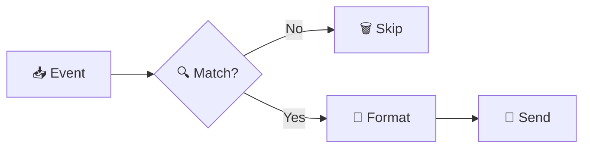

# Routes

Routes are the heart of KETE. They define **what** events go **where**.

## What is a Route?

Think of a route like a mail forwarding rule:

> "When I get a LOGIN event from the master realm, convert it to JSON and send it to Kafka."

Every route has five parts:

| Part | What it does | Required? |
|------|--------------|:---------:|
| **Realm Matchers** | Which realms to listen to | No |
| **Event Matchers** | Which events to forward | No |
| **Serializer** | What format to use | No (JSON default) |
| **Destination** | Where to send events | ✅ Yes |
| **Retry** | Retry on failure | No |

## How Routes Work



1. **Event arrives** from Keycloak
2. **Matchers filter** — does this route want this event?
3. **Serializer formats** — convert to JSON, XML, etc.
4. **Destination sends** — deliver to Kafka, RabbitMQ, etc.

## Quick Example

Send login events to Kafka:

```bash
kete.routes.logins.event-matchers.filter=glob:LOGIN*
kete.routes.logins.destination.kind=kafka
kete.routes.logins.destination.bootstrap.servers=kafka:9092
kete.routes.logins.destination.topic=login-events
```

Without matchers, a route accepts all events from all realms.

## Disabling Routes

Routes are enabled by default. To disable a specific route:

```bash
kete.routes.my-route.enabled=false
```

To disable KETE entirely, see [Enabling & Disabling](enabling-disabling.md).

## Multiple Routes

Define as many routes as you need. Each works independently:

```bash
# Route 1: Everything to Kafka
kete.routes.all.destination.kind=kafka
kete.routes.all.destination.bootstrap.servers=kafka:9092
kete.routes.all.destination.topic=all-events

# Route 2: Errors to webhook
kete.routes.alerts.event-matchers.filter=glob:*_ERROR
kete.routes.alerts.destination.kind=http
kete.routes.alerts.destination.url=https://alerts.example.com/hook
```

## Match Modes

When you have multiple matchers, you can control how they combine:

| Mode | Behavior |
|------|----------|
| `any` | Event matches if **any** matcher accepts it (default) |
| `all` | Event matches only if **all** matchers accept it |

```bash
# Match mode for realm matchers
kete.routes.strict.realm-match-mode=all

# Match mode for event matchers
kete.routes.strict.event-match-mode=all
```

### Example: Match Multiple Event Types (any)

```bash
# Match LOGIN OR LOGOUT events (default mode is 'any')
kete.routes.auth.event-matchers.login=glob:LOGIN*
kete.routes.auth.event-matchers.logout=glob:LOGOUT*
kete.routes.auth.destination.kind=kafka
kete.routes.auth.destination.bootstrap.servers=kafka:9092
kete.routes.auth.destination.topic=auth-events
```

### Example: Require All Conditions (all)

```bash
# Match only events that match BOTH patterns
kete.routes.strict.event-match-mode=all
kete.routes.strict.event-matchers.must-be-login=glob:LOGIN*
kete.routes.strict.event-matchers.must-not-error=glob:not:*_ERROR
kete.routes.strict.destination.kind=http
kete.routes.strict.destination.url=https://api.example.com/events
```

## Retry

Retry is enabled by default (3 attempts, 500ms between retries). Customize retry settings per route:

```bash
kete.routes.reliable.retry.max-attempts=5
kete.routes.reliable.retry.wait-duration=PT2S
```

See [Retry](retry.md) for full configuration options and duration formats.
